#    Practica 3 GIT
##  Historial de Cambios - Deshacer cambios

######   Jorge Jankovich Ramos - 2020

1. Entra en el directorio de la práctica2 (practica2git) y a partir de ahí realizaremos esta práctica. 
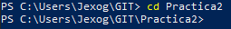

2. Crea la carpeta "unidades" y dentro de ella un fichero llamado windows1.txt con el siguiente texto: 
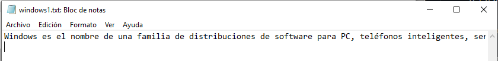

3. Añade los cambios realizados a la zona de preparado. 
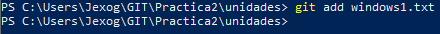

4. Hacer un commit con el comentario "Añadido fichero windows1". 
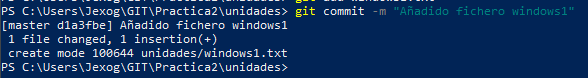

5. Mostrar de nuevo el historial de cambios del repositorio. 
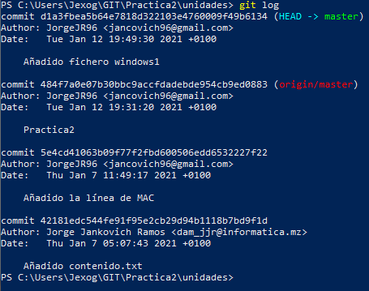

6. Creal el fichero "windows2.txt" dentro de "unidades" con el texto: 
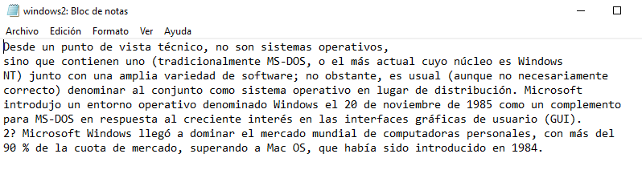

7. Añade los cambios a la zona de preparado. 
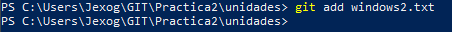

8. Hacer commit de cambios con el comentario "añadido windows2.txt". 
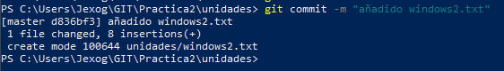

9. Mostrad las diferencias entre los dos últimos commits (Esto se explica en clase). 
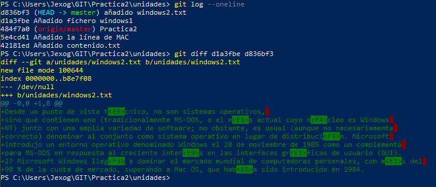

10. Añade al fichero windows2.txt las lineas: 
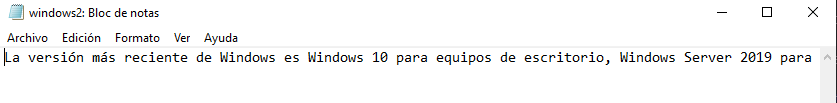

11. Añade los cambios a la zona de preparado. 
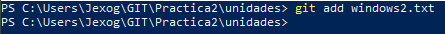

12. Commit de los cambios con el comentario "Añadidas versiones a windows2.txt". 
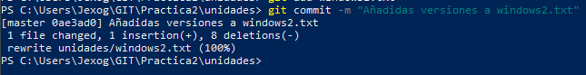

13. Mostrad quien ha hecho cambios en el fichero windows2.txt. 
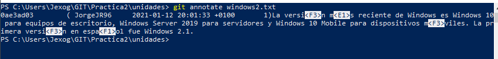